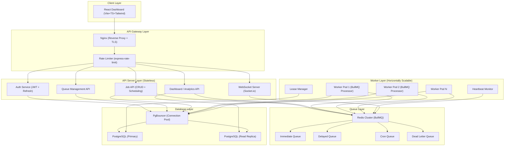
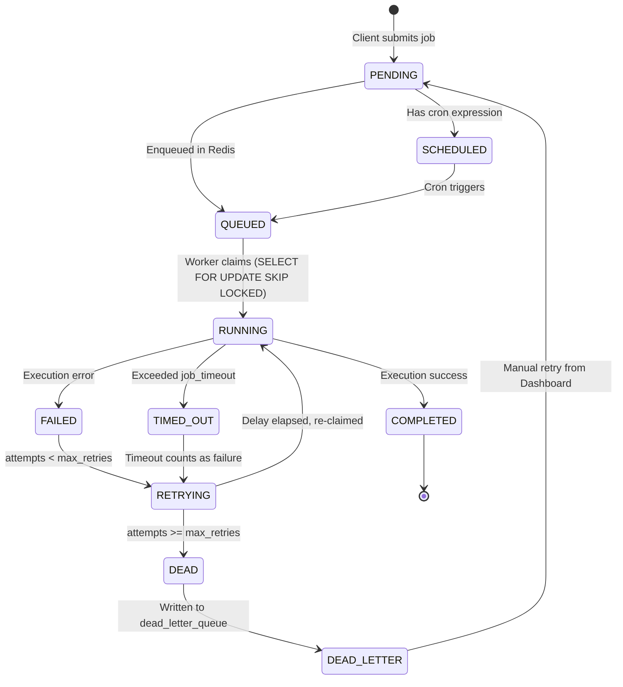
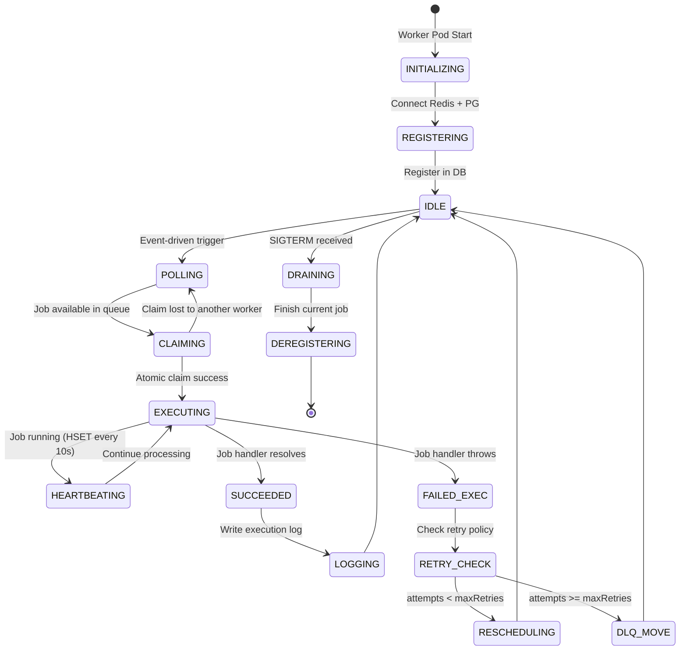
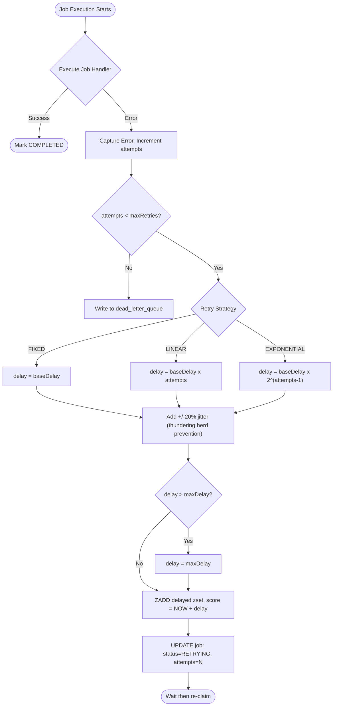
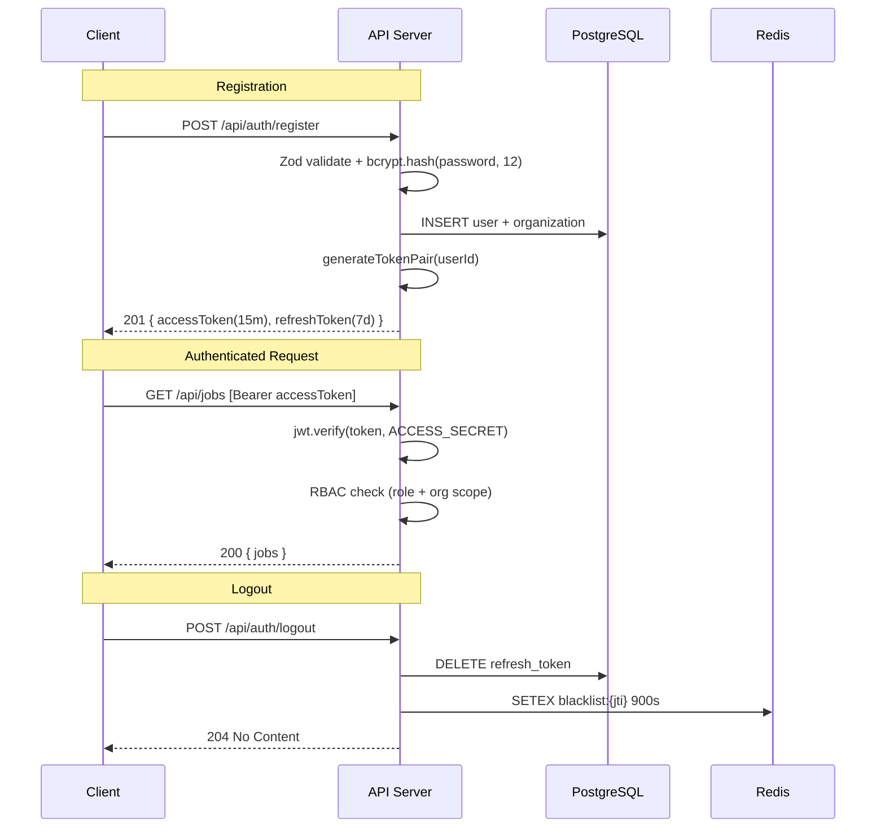
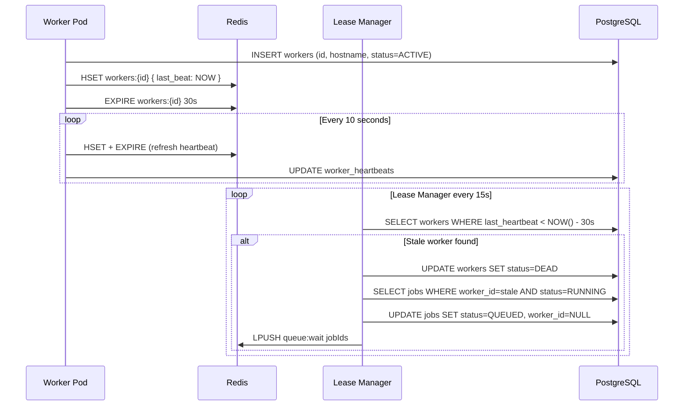
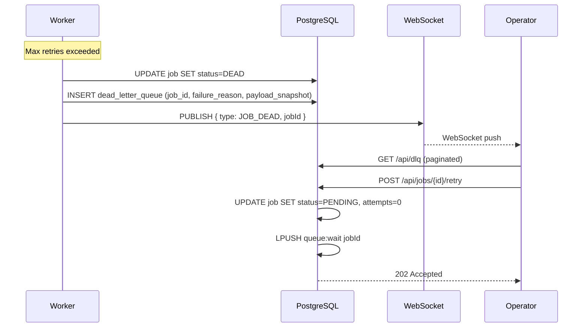
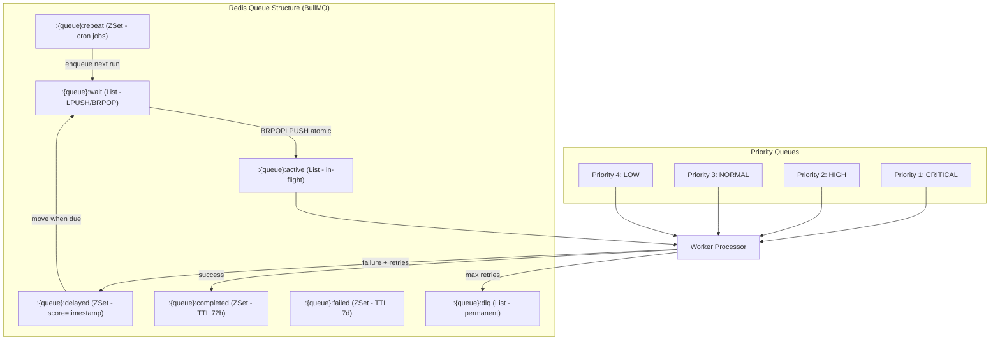
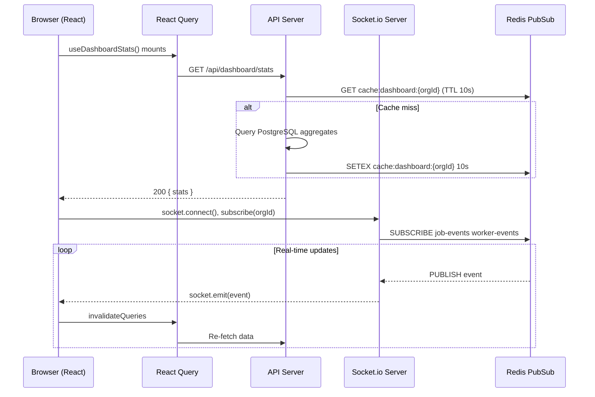

# Distributed Job Scheduler — System Architecture

> **Author:** Principal Software Architect (Stripe-grade)
> **Version:** 1.0.0
> **Document Type:** Enterprise Architecture Specification

---

## Executive Summary

Production-grade **Distributed Job Scheduler Platform** capable of processing **millions of jobs per day** with sub-second job pickup latency, guaranteed at-least-once delivery, and full observability.

Architecturally inspired by:
- **BullMQ** — Redis-backed queue semantics
- **Sidekiq** — Worker concurrency model
- **AWS SQS + Lambda** — Decoupled queue-consumer model
- **Stripe payments pipeline** — Idempotency, retry semantics, audit trails

---

## 1. High-Level Architecture

**Purpose:** Establishes separation of concerns across 6 distinct layers. No layer communicates with a non-adjacent layer directly.

**Scalability:** Stateless API servers and worker pods scale independently. PgBouncer caps DB connections.

**Reliability:** Fault isolation — a queue failure does not bring down the API.

---

## 2. Job Lifecycle State Machine

---

## 3. Worker Lifecycle State Machine

---

## 4. Retry Flow

---

## 5. Authentication Flow

---

## 6. Worker Heartbeat Flow

---

## 7. Dead Letter Queue Flow

---

## 8. Queue Architecture

---

## 9. Dashboard Communication Flow

---

## Architecture Summary Table

| Concern | Solution | Rationale |
|---------|----------|-----------|
| Job Queue | BullMQ + Redis | Atomic ops, priority, delays, cron |
| Database | PostgreSQL + Prisma | ACID, complex queries |
| Concurrency | SELECT FOR UPDATE SKIP LOCKED | Native PG, no distributed lock overhead |
| Retry | Exponential backoff + jitter | Prevents thundering herd |
| Recovery | Heartbeat + Lease Manager | Zero job loss on crash |
| Auth | JWT (15m) + Refresh (7d) | Secure, stateless, revocable |
| Real-time | Socket.io + Redis PubSub | Scales across multiple API instances |
| Deployment | Docker Compose | Reproducible, portable |
| Observability | Winston + structured logs | Queryable, production-grade |

---
*Architecture Phase Complete — Next: Database Design (Phase 2)*
