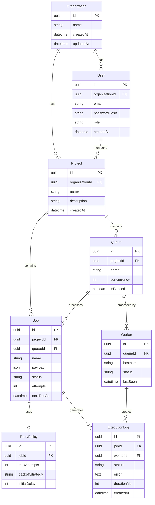

# Database Design

This document details the database schema, entity relationships, indexing strategies, and performance optimizations for the Distributed Job Scheduler Platform.

## Entity Relationship Diagram



## Table Definitions

### 1. Organization
*   **Purpose**: Top-level tenant entity for multi-tenancy support.
*   **Key Columns**: `id` (UUID), `name` (String, unique).
*   **Indexes**: Primary Key on `id`, Unique Index on `name`.
*   **Cascade Rules**: Deleting an organization cascades to all Users and Projects.

### 2. User
*   **Purpose**: Authentication and authorization identity.
*   **Key Columns**: `id`, `email`, `passwordHash`, `role` (ADMIN, MEMBER, VIEWER).
*   **Indexes**: Unique Index on `email`. FK Index on `organizationId`.
*   **Cascade Rules**: Inherits cascade from Organization.

### 3. Project
*   **Purpose**: Logical grouping of jobs and queues within an organization.
*   **Key Columns**: `id`, `name`.
*   **Indexes**: FK Index on `organizationId`.
*   **Cascade Rules**: Deleting a project cascades to Queues and Jobs.

### 4. Queue
*   **Purpose**: Represents a logical message queue mapped to BullMQ.
*   **Key Columns**: `name` (unique per project), `concurrency`, `isPaused`.
*   **Indexes**: Unique Index on `(projectId, name)`.

### 5. Job
*   **Purpose**: The core entity representing a unit of work.
*   **Key Columns**: `payload` (JSONB), `status` (PENDING, ACTIVE, COMPLETED, FAILED, DELAYED), `nextRunAt`.
*   **Indexes**: 
    *   Index on `status` (Highly queried).
    *   Index on `nextRunAt` (Used by scheduler).
    *   Index on `queueId` for filtering.
*   **Cascade Rules**: Deletion cascades to RetryPolicy and ExecutionLog.

### 6. ExecutionLog
*   **Purpose**: Audit trail and historical tracking for job runs.
*   **Key Columns**: `jobId`, `workerId`, `status`, `durationMs`.
*   **Indexes**: Index on `jobId`, Index on `createdAt` (for retention policies).

## Hot Query Patterns

1.  **Job Polling (Scheduler)**:
    ```sql
    SELECT * FROM "Job" 
    WHERE status IN ('PENDING', 'DELAYED') AND "nextRunAt" <= NOW() 
    ORDER BY "nextRunAt" ASC LIMIT 50 FOR UPDATE SKIP LOCKED;
    ```
    *Optimized by*: Composite index on `(status, nextRunAt)`.

2.  **Dashboard Aggregations**:
    ```sql
    SELECT status, COUNT(*) FROM "Job" 
    WHERE "projectId" = $1 AND "createdAt" >= NOW() - INTERVAL '24 HOURS' 
    GROUP BY status;
    ```
    *Optimized by*: Index on `(projectId, createdAt, status)`.

## Performance Optimizations

*   **JSONB over JSON**: Job payloads are stored as `JSONB` to allow for efficient binary storage and indexing of payload fields if necessary.
*   **Table Partitioning**: (Future) `ExecutionLog` is designed to be partitioned by `createdAt` (monthly) to easily drop old log data without heavy `DELETE` statements.
*   **UUIDv7**: Using UUIDv7 (or sorted UUIDs) for primary keys to minimize index fragmentation.
*   **SKIP LOCKED**: Implementing optimistic locking using `FOR UPDATE SKIP LOCKED` on job picking to prevent worker contention.
